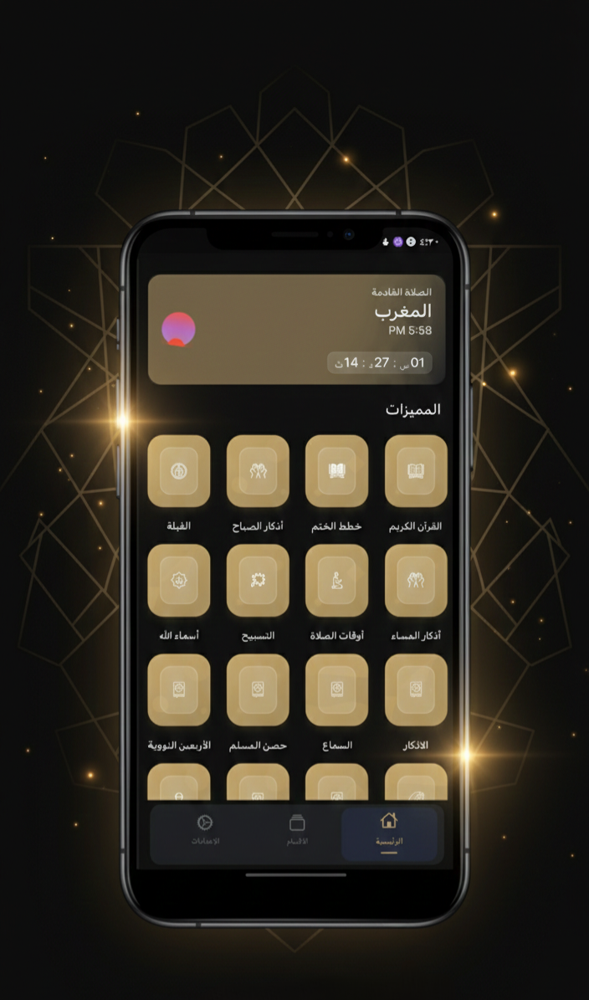
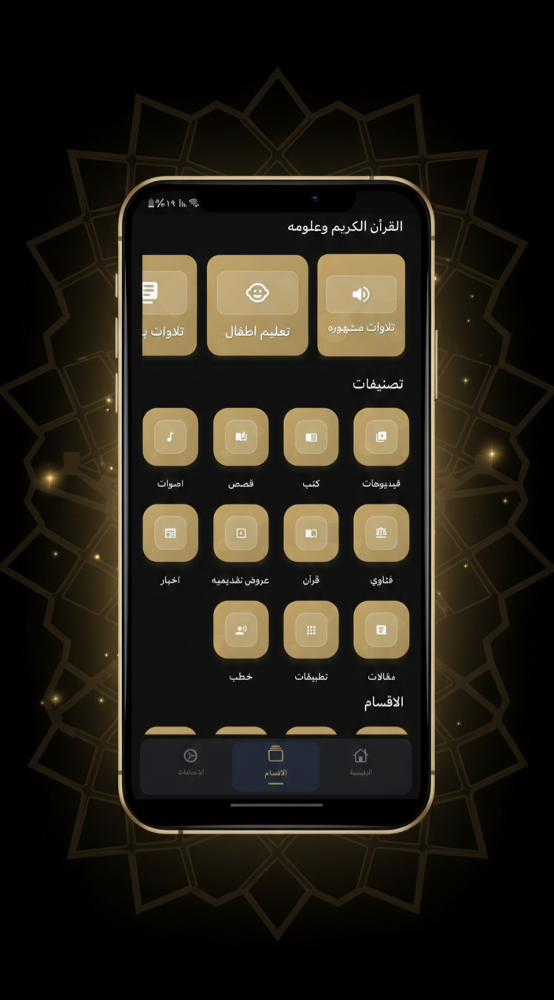
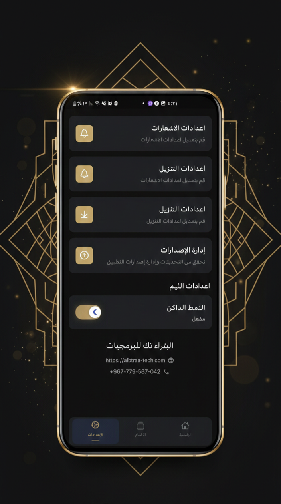

<div align="center">

# 📖 تطبيق يقين – الموسوعة الدينية
### Yaqeen App – Islamic Comprehensive Encyclopedia

<p align="center">
  <b>دليلك الشامل للقرآن الكريم، الأذكار، مواقيت الصلاة والعبادات اليومية</b>
  <br />
  <i>Your comprehensive guide for the Holy Qur'an, Athkar, Prayer Times, and Daily Worship.</i>
</p>

[](https://flutter.dev)
[](https://dart.dev)
[](https://bloclibrary.dev)
[](#-architecture--structure)
[](#)
[](LICENSE)

</div>

---

## 📱 لقطات من التطبيق (Screenshots)

<div align="center">
  <table>
    <tr>
      <td align="center" width="33%">
        
        <br />
        <b>الواجهة الرئيسية & مواقيت الصلاة</b>
      </td>
      <td align="center" width="33%">
        
        <br />
        <b>المصحف الشريف والتلاوات</b>
      </td>
      <td align="center" width="33%">
        
        <br />
        <b>الأذكار، الأدعية، والمكتبة</b>
      </td>
    </tr>
  </table>
</div>

---

## ✨ المميزات الرئيسية (Main Features)

- 📖 **قراءة القرآن الكريم:** بالرسم العثماني المعتمد، مع علامات الوقف، التجويد، والتحكم بحجم الخط ووضع القراءة الليلي.
- 🎧 **الاستماع الصوتي:** تلاوات بأصوات نخبة من مشاهير القرّاء مع إمكانية التنزيل للاستماع دون اتصال بالإنترنت.
- ⏰ **مواقيت الصلاة والأذان:** حساب فلكي دقيق حسب موقع المستخدم الجغرافي، مع تنبيهات الأذان والعد التنازلي للصلاة القادمة.
- 🕋 **بوصلة القبلة:** تحديد اتجاه القبلة بدقة عالية مع عرض المسافة إلى الكعبة المشرفة.
- 📿 **حصن المسلم والأذكار:** موسوعة شاملة لأذكار الصباح والمساء وبعد الصلاة ومسبحة إلكترونية متطورة.
- 🔍 **البحث الذكي في القرآن:** محرك بحث سريع ودقيق يدعم البحث بالتشكيل وبدون تشكيل.
- 🔖 **العلامات المرجعية:** حفظ مواضع القراءة والرجوع إليها بسهولة.
- ✨ **أسماء الله الحسنى:** استعراض أسماء الله الحسنى مع شرح معانيها وفضائلها.
- 📚 **المكتبة الإسلامية:** كتب ومراجع إسلامية متكاملة قابلة للتصفح والقراءة.
- 🌓 **دعم الوضع الليلي والنهاري (Dark / Light Mode):** واجهة عصرية ومريحة للعين.
- 📱 **العمل بدون إنترنت (Offline Mode):** تخزين محلي ذكي لقواعد البيانات والصوتيات.

---

## 🛠️ البنية التقنية (Tech Stack & Architecture)

- **Framework:** [Flutter](https://flutter.dev) (Dart SDK `^3.6.0`)
- **Architecture:** Clean Architecture (Presentation, Domain, Data Layers)
- **State Management:** [Flutter BLoC](https://pub.dev/packages/flutter_bloc) & RxDart
- **Local Database:** [SQLite (sqflite)](https://pub.dev/packages/sqflite) & SharedPreferences
- **Networking & API:** [Dio](https://pub.dev/packages/dio) & REST APIs
- **Audio & Media:** [just_audio](https://pub.dev/packages/just_audio), [audio_video_progress_bar](https://pub.dev/packages/audio_video_progress_bar)
- **Location & Prayer Times:** [Geolocator](https://pub.dev/packages/geolocator), [Adhan](https://pub.dev/packages/adhan), [Flutter Qiblah](https://pub.dev/packages/flutter_qiblah)
- **Dependency Injection:** [GetIt](https://pub.dev/packages/get_it)
- **UI & Responsiveness:** [flutter_screenutil](https://pub.dev/packages/flutter_screenutil), [flutter_animate](https://pub.dev/packages/flutter_animate)

---

## 📂 هيكل المشروع (Project Structure)

```
lib/
├── core/                   # المشتركات، الثيمات، الأدوات والخدمات العامة
│   ├── components/         # العناصر المشتركة (Widgets)
│   ├── extensions/         # امتدادات Dart و Flutter
│   ├── services/           # خدمات الإشعارات، الصوت، وقواعد البيانات
│   ├── shared/             # الموارد والثوابت (Assets Manager, Constants)
│   ├── theme/              # إعدادات الألوان والثيم
│   └── util/               # دوال مساعدة
└── features/               # الميزات مقسمة وفق Clean Architecture
    ├── azkar/              # ميزة الأذكار والتسبيح
    ├── books/              # المكتبة الإسلامية
    ├── categories/         # تصنيفات المحتوى
    ├── download/           # إدارة التنزيلات
    ├── home/               # الواجهة الرئيسية
    ├── prayer_time/        # مواقيت الصلاة والقبلة
    ├── quran/              # تصفح وقراءة القرآن
    ├── quran_audio/        # مشغل الصوت والتلاوات
    ├── quran_plan/         # خطط الختمة والقراءة
    └── setting/            # الإعدادات ومعلومات التطبيق
```

---

## 🚀 تشغيل المشروع محلياً (Getting Started)

### المتطلبات المسبقة:
- تثبيت [Flutter SDK](https://flutter.dev/docs/get-started/install) (إصدار 3.6.0 أو أحدث).
- بيئة تطوير متكاملة مثل [VS Code](https://code.visualstudio.com/) أو [Android Studio](https://developer.android.com/studio).

### خطوات التثبيت:

1. **استنساخ المستودع (Clone the repo):**
   ```bash
   git clone https://github.com/your-username/quran_app.git
   cd quran_app
   ```

2. **تحميل الحزم والاعتماديات (Get dependencies):**
   ```bash
   flutter pub get
   ```

3. **توليد الملفات اللازمة (Build runner):**
   ```bash
   flutter pub run build_runner build --delete-conflicting-outputs
   ```

4. **تشغيل التطبيق (Run the app):**
   ```bash
   flutter run
   ```

---

## 👨‍💻 المطور (Developer)

تم تطوير وتصميم هذا التطبيق بواسطة:
**المهندس عمر عبدالعزيز البتراء** *(Eng. Omar Abdulaziz Al-Batra)*

- 🌐 **Facebook:** [omar11batra](https://facebook.com/omar11batra)

---

## 📄 الترخيص (License)

هذا المشروع متاح تحت رخصة [MIT License](LICENSE) - يمكنك استخدامه وتطويره للأغراض الشخصية والدعوية.
